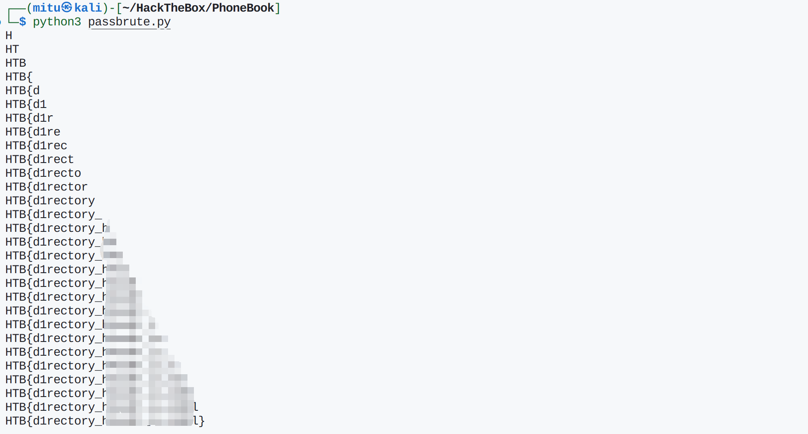

## 题目

> You and your buddy corrected the math in your physics teacher's paper on the decay of highly excited massive string states in the footnote of a renowned publication. He's just failed your thesis out of spite, for making a fool out of him in the university's research symposium. Now you can't graduate, unless you can do something about it... 🤷

> (您和您的好友在一本著名出版物的脚注中更正了物理老师关于高激发大质量弦态衰变的论文中的数学计算。 他只是出于恶意而没通过你的论文，因为他在大学的研究研讨会上出丑了。 现在你无法毕业，除非你能做点什么......)

## 思路

Web页面很简单，目标似乎是通过某种方式，让我们的主角顺利毕业。分析代码我们可以看到，毕业的条件有两个：

1. Paper评分大于等于10；
2. 名字不是Baker或者Purvis；

得罪教授果然没什么好下场。

玩笑结束，我们来分析代码。可交互的路径就两个：`/debug/:action`和`/api/calculate`

通过跟踪参数的处理过程，我们大概可以锁定有问题的代码在`challenge\helpers\ObjectHelper.js`中（凭直觉）：

坦白讲我对NodeJS一窍不通，所以看不出这段代码有什么问题，所以让我们问问万能的ChatGPT吧。

以下是ChatGPT的回答：

------------
让我们首先查看文件的内容，然后进行分析。

这段代码定义了一个名为 `ObjectHelper` 的模块，包含以下四个方法：

1. **isObject(obj)**:
    - 参数: `obj`（一个任意类型的对象）
    - 返回值: 如果 `obj` 是一个函数或对象，返回 `true`，否则返回 `false`。
    - 作用: 用于检查一个值是否是对象或函数。

2. **isValidKey(key)**:
    - 参数: `key`（一个字符串）
    - 返回值: 如果 `key` 不等于 `'__proto__'`，则返回 `true`，否则返回 `false`。
    - 作用: 用于检查一个键是否有效，主要是为了防止原型污染。

3. **merge(target, source)**:
    - 参数: `target` 和 `source`（两个对象）
    - 返回值: 返回合并后的 `target` 对象。
    - 作用: 
        - 该方法用于将 `source` 对象的属性合并到 `target` 对象中。
        - 如果 `source` 对象的某个键在 `target` 对象中也存在，并且它们的值都是对象，则会递归地合并这两个子对象。
        - 否则，会直接将 `source` 对象的属性值赋给 `target` 对象的对应键。

4. **clone(target)**:
    - 参数: `target`（一个对象）
    - 返回值: 返回 `target` 对象的一个深拷贝。
    - 作用: 
        - 该方法用于创建一个新对象，并将 `target` 对象的属性复制到新对象中。
        - 为了实现这一点，它实际上是调用了 `merge` 方法，将一个空对象和 `target` 对象合并。

总结:
这是一个用于对象操作的实用程序模块，提供了对象合并、克隆和一些基本的验证功能。特别是，它通过 `isValidKey` 方法防止了潜在的原型污染，这是一个很好的安全实践。

------------

很好，ChatGPT说这段代码采取了某些方式防止“原型污染”，所谓此地无银三百两，这个题目八成是要搞原型污染了。~~（脑补费翔：她明明是祥Ray！）~~

查阅若干资料之后，对NodeJS原型链污染漏洞大概有了个了解，类比一下就是，虽然龙生九子各有不同，但是如果我们通过龙的某个子嗣比如貔貅，改变了龙的某个属性，那么它的九个崽儿就都会继承这个属性（其实不恰当，实际上是调用的时候如果当前对象没有这个参数，就会向它的父对象搜索）。

题目中过滤了关键字`'__proto__'`，但是通过`constructor.prototype`，我们仍然可以实现原型链污染。接下来找到一个利用点，也就是能够执行系统命令的函数就可以了，这里我们选择`DebugHelper.js`中的fork函数。

## 解题

构造Payload，获取Flag文件名（因为根据DockerFile，Flag文件名是随机的字符串）：

然后访问`/debug/version`执行poc：

最后读文件的内容就好了：

## 后记

~~做HTB真是被迫从零开始学习NodeJS~~

## 参考资料

- [nodejs原型链污染 #](https://wiki.wgpsec.org/knowledge/ctf/js-prototype-chain-pollution.html)
- [HackTheBox Breaking Grad](https://y3a.github.io/2021/06/15/htb-breaking-grad/)